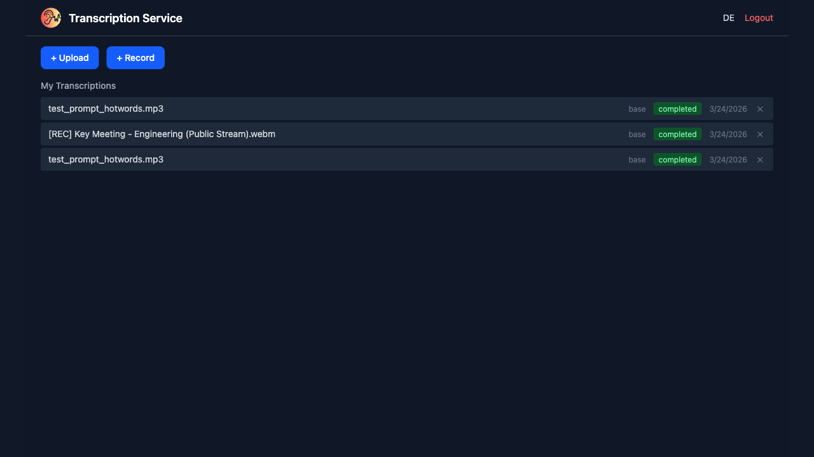

# Transcription Service App

[Transcription Service App](https://transcription.uni-osnabrueck.de/) is a web app for universities to make simple transcriptions from video or audio files in multiple languages, currently tailored towards OpenAI's Whisper models.



## Features

- Configurable access to OpenAI's Whisper models (tiny, base, small, medium, large-v1, large-v2, large-v3, large-v3-turbo).
- Supports upload of video and audio files (up to 1GB).
- In-browser audio and video recording with device selection and level metering.
- Editable transcription results with inline subtitle editing synchronized with video playback — click any text cell to edit, Tab/Shift+Tab to navigate between rows, Escape to exit.
- Subtitle search with text and speaker scope filtering, context display around matches.
- Export and download in 4 formats (TXT, VTT, SRT and JSON).
- Diarization support to detect and label multiple speakers (up to 20).
- Speaker mapping to assign custom names to detected speakers — hover pencil icon on any speaker cell, color-coded speaker dots, name suggestions from existing names.
- SRT, VTT and JSON formats provide timestamp and speaker information (when available).
- Transcribed subtitles can be activated in uploaded videos.
- Initial prompt support to provide context for the transcription.
- Hotwords support to improve recognition of rare or technical terms.
- Unified Analysis tab with selectable templates: summary with chapters, meeting protocol, agenda-based notes, or fully custom prompts.
- Selectable output language for analysis results, defaulting to the detected transcript language.
- Optional user-defined chapter hints and agenda to guide LLM analysis.
- Editable LLM prompts — view and customize the prompt before generating analysis results.
- LLM-powered transcription refinement to fix spelling, punctuation, terminology, filler words, and disfluencies — with original/refined toggle, per-utterance diff view, and changes summary.
- LLM-powered caption translation to any supported language with Original/Translated view toggle and cached results.
- User-defined presets for transcription, analysis, and refinement — bundle them together to auto-run a full pipeline (transcribe → refine → analyze → translate) on upload with a single click.
- Inline file renaming in transcription history.
- Copy, download, and delete generated analysis results.
- LLM provider and model attribution display on generated content.
- Transcription history as default landing page with persistent storage.
- Auto-generated transcription titles via LLM (overridable through inline rename).
- In-app help drawer with a bilingual (English/German) user manual covering every feature.
- Per-item expiration with configurable retention — files expire after a default period (3 days), with an "archive" action to extend retention (180 days).
- Real-time progress updates via WebSocket.
- Responsive layout — mobile-friendly UI with no horizontal overflow on small screens.
- System audio capture for recording online meetings (experimental; best on Chrome/Edge on Windows).
- Transcription in ~99 languages; UI localized in English and German.

## Architecture

The application uses a decoupled frontend/backend architecture:

- **Frontend**: React 19 + TypeScript SPA built with Vite, using Zustand for state management and Tailwind CSS for styling.
- **Backend**: FastAPI (Python 3.12) with async SQLite database, serving the built frontend as static files.
- **ASR**: Pluggable speech recognition backends — [MurmurAI](https://github.com/namastexlabs/murmurai) or WhisperX.
- **LLM**: Pluggable LLM providers — OpenAI-compatible API (OpenAI, vLLM, etc.) or Ollama.
- **Deployment**: Multi-stage Docker build combining both frontend and backend into a single image.

## Usage & Configuration

You need to set up an ASR backend to work with this app. Supported options:

- [MurmurAI API server](https://github.com/namastexlabs/murmurai) (remote API)
- [WhisperX API server](https://github.com/Nyralei/whisperx-api-server) (remote API)

Copy `.env.example` to `.env` and configure your environment variables:

```bash
# ASR Configuration
ASR_BACKEND=murmurai              # or: whisperx
ASR_URL=http://localhost:8880
ASR_API_KEY=                      # required for MurmurAI only
ASR_MAX_CONCURRENT=3              # max concurrent WhisperX requests

# ASR Model Configuration
WHISPER_MODELS=base,large-v3,large-v3-turbo
DEFAULT_WHISPER_MODEL=base

# LLM Configuration (for analysis, translation, and transcription refinement)
LLM_PROVIDER=openai               # or: ollama (openai works with any OpenAI-compatible API like vLLM)
LLM_MODEL=gpt-4o
LLM_API_KEY=                      # required for OpenAI / OpenAI-compatible APIs
LLM_BASE_URL=                     # for custom endpoints (e.g., vLLM, Ollama: http://localhost:11434)

# UI Configuration
POPULAR_LANGUAGES=de,en,es,fr       # languages pinned at top of dropdowns (comma-separated codes)
ENABLED_LANGUAGES=                  # allowlist of languages (comma-separated codes); unset = all enabled

# Application
TEMP_PATH=tmp/transcription-files
FFMPEG_PATH=ffmpeg
FFPROBE_PATH=ffprobe
LOGOUT_URL=/oauth2/sign_out
DEFAULT_EXPIRY_HOURS=72           # auto-delete files after this many hours (default 3 days)
ARCHIVE_EXPIRY_HOURS=4320         # archived files kept for this many hours (default 180 days)
DATABASE_PATH=                    # SQLite DB path, defaults to {TEMP_PATH}/transcription.db

# Metrics
ENABLE_METRICS=true

# Development
DEV_MODE=false                    # enables CORS for localhost:5173 (Vite dev server)
```

## Docker

Build and run the application with Docker:

```bash
docker build -t transcription-app .
docker run -p 8000:8000 --env-file .env transcription-app
```

The app will be available at `http://localhost:8000`.

For subpath deployments behind a reverse proxy (e.g., serving at `/transcription/`):

```bash
docker build --build-arg VITE_BASE_PATH=/transcription -t transcription-app .
```

## Development

### Backend

Install Python dependencies and run the FastAPI server:

```bash
cd backend
pip install -r requirements.txt
uvicorn app.main:app --reload --port 8000
```

### Frontend

Install Node.js dependencies and start the Vite dev server:

```bash
cd frontend
npm install
npm run dev
```

The Vite dev server runs on `http://localhost:5173` and proxies API requests to the backend at `http://localhost:8000`.

Set `DEV_MODE=true` in your `.env` to enable CORS for the Vite dev server.

## Prometheus Metrics

The application includes comprehensive Prometheus metrics for monitoring usage and performance. When enabled, metrics are exposed at `/metrics` for Prometheus to scrape.

### Available Metrics

- **Application Info**:
  - `transcription_app_info` — Application version and metadata

- **File Uploads**:
  - `transcription_file_uploads_total` — Total uploads by file type and status (success/rejected)
  - `transcription_file_upload_size_bytes` — Upload size distribution
  - `transcription_file_renames_total` — Total file renames

- **Transcription Jobs**:
  - `transcription_jobs_total` — Total jobs by backend, language, model, and status
  - `transcription_duration_seconds` — Wall-clock processing time by backend, language, and model
  - `transcription_audio_duration_seconds` — Input media length (seconds) by backend — pair with `transcription_duration_seconds` to derive realtime factor
  - `transcription_realtime_factor` — Processing time divided by audio duration by backend and model (<1 = faster than realtime)
  - `transcription_active_jobs` — Number of currently processing jobs
  - `transcription_queue_depth` — Jobs waiting in `pending` state before ASR pickup
  - `transcription_queue_wait_seconds` — Time spent in `pending` before processing started (by backend)
  - `transcription_diarization_speakers_detected` — Speakers detected per job distribution

- **Editing & Interaction**:
  - `transcription_edits_saved_total` — Transcription edits saved
  - `transcription_speaker_renames_total` — Speaker mapping updates
  - `transcription_downloads_total` — Exports/downloads by format

- **LLM (Analysis, Translation, Refinement & Titles)**:
  - `transcription_llm_requests_total` — LLM requests by provider, model, and operation
  - `transcription_llm_duration_seconds` — LLM request duration by provider, model, and operation
  - `transcription_llm_errors_total` — LLM errors by provider, model, and operation
  - `transcription_llm_tokens_total` — Tokens consumed by provider, model, operation, and kind (`prompt`/`completion`); emitted per LLM call so chunked operations aggregate. Operations include `analysis`, `translation`, `refinement`, `title`.

- **Deletions**:
  - `transcription_deletions_total` — Resource deletions by type (transcription/analysis/translation/refinement)

- **WebSocket**:
  - `transcription_websocket_connections_active` — Active WebSocket connections
  - `transcription_websocket_connections_total` — Total WebSocket connections
  - `transcription_websocket_messages_sent_total` — Messages sent to clients by type (`status`/`error`)
  - `transcription_websocket_disconnects_total` — Disconnects by reason (`client_disconnect`, `auth_missing`, `not_found`, `completed`, `failed`, `not_found_record`, `error`)

- **Storage**:
  - `transcription_storage_bytes` — Disk usage of the media/DB volume, refreshed at startup and after each cleanup run (labelled by `path`)

- **Auth**:
  - `transcription_auth_failures_total` — Authentication failures by reason (`missing_headers`, `ws_missing_headers`)

- **Cleanup**:
  - `transcription_cleanup_runs_total` — Cleanup job runs by status (success/failed)
  - `transcription_cleanup_items_deleted_total` — Items deleted by resource type

- **API & Errors**:
  - `transcription_api_request_duration_seconds` — API request latency by endpoint, method, and status
  - `transcription_errors_total` — Errors by type and component

> Breaking change: `transcription_jobs_total` and `transcription_duration_seconds` now carry an additional `backend` label (`murmurai` / `whisperx`). Existing dashboards and alerts will need to include the new label or aggregate it away.

### Configuration

- `ENABLE_METRICS=true` - Enable/disable metrics collection (default: true)

### Prometheus Configuration

Add this job to your `prometheus.yml`:

```yaml
scrape_configs:
  - job_name: 'transcription-app'
    static_configs:
      - targets: ['localhost:8000']
    scrape_interval: 15s
    metrics_path: /metrics
```

### Grafana Dashboard

The metrics are designed to work well with Grafana. Key dashboard panels might include:

- Active transcription jobs, queue depth, and WebSocket connections over time
- Transcription success/failure rates by backend, model, and language
- Realtime factor (RTF) distribution by backend/model — speed of transcription vs audio length
- Queue wait time percentiles — backpressure signal
- File upload volume and sizes
- LLM request duration, error rates, and token consumption (prompt vs completion) by provider/operation
- Export/download format distribution
- Disk usage trend and cleanup job effectiveness
- WebSocket disconnect reasons (client vs error vs auth)

## Authors

virtUOS
