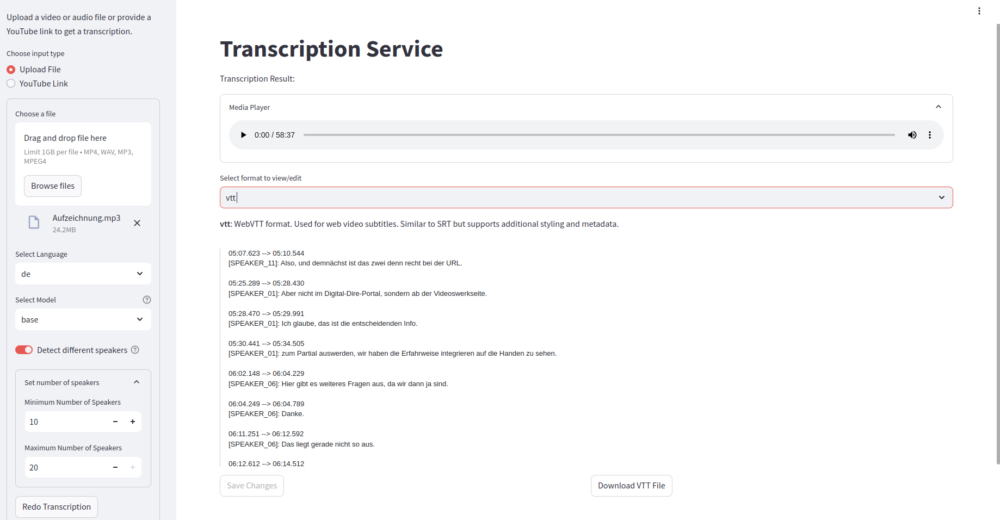

# Transcription Service App

[Transcription Service App](https://pvm002.virtuos.uni-osnabrueck.de/) is a web app for universities to make simple transcriptions from video or audio files in multiple languages, currently tailored towards Open AI's Whisper models.



Some of its features are:
- Supports transcriptions with or without simultaneous translations to multiple languages.
- Simple interface.
- Configurable access to Open AI's Whisper models (tiny, base, small, medium, large-v1, large-v2, large-v3, large-v3-turbo).
- Supports upload from videos and audio files (up to 1gb).
- Users can edit and download transcription results in 4 different formats (txt, vtt, srt and json).
- Diarization support to detect multiple speakers (up to 20).
- Srt, vtt and json formats provide timestamp and speaker information (when available).
- Transcribed subtitles can be activated in uploaded videos.

# Usage & Configuration

You first need to set up a [whisperx API server](https://github.com/virtUOS/whisperx-api) to work with this app.

Some environment variables should be set. Here is an example of a .env file:

```yml
# PATH to the ffmpeg library in your system
FFMPEG_PATH=/usr/bin/ffmpeg
# Path where temporal files will be generated
TEMP_PATH=transcription-whisper-temp
# Uncomment this up if you're using an authentication process to allow users to log out
#LOGOUT_URL=/oauth2/sign_out
# Url and port to the API server
API_URL=http://111.111.111.11:11300
# Available Whisper models (comma-separated)
WHISPER_MODELS=tiny,base,small,medium,large-v1,large-v2,large-v3,large-v3-turbo
# Default model selection
DEFAULT_WHISPER_MODEL=base
```

## Development

The app is developed in the [streamlit](https://streamlit.io/) framework.

You can install the requirements needed to run and develop the app using `pip install -r requirements.txt`.
Then simply run a development server like this:

```bash
streamlit run app.py
```

## Authors

virtUOS
