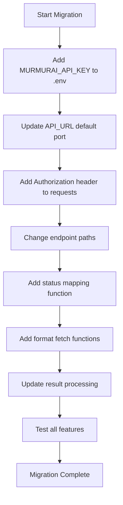

# MurmurAI Migration Plan

## Overview

This document outlines the plan to migrate the transcription app from the current WhisperX API to MurmurAI. The UI will remain unchanged - all user options (model, language, speaker settings) will be preserved.

## API Comparison

### Current WhisperX API
| Aspect | Details |
|--------|---------|
| Base URL | `http://localhost:11300` |
| Auth | None (internal service) |
| Submit Job | `POST /jobs` |
| Check Status | `GET /jobs/{task_id}` |
| Response Format | Custom JSON with `txt_content`, `json_content`, `srt_content`, `vtt_content` |

### MurmurAI API
| Aspect | Details |
|--------|---------|
| Base URL | `http://localhost:8880` |
| Auth | Header `Authorization: {API_KEY}` |
| Submit Job | `POST /v1/transcript` |
| Check Status | `GET /v1/transcript/{id}` |
| Export SRT | `GET /v1/transcript/{id}/srt` |
| Export VTT | `GET /v1/transcript/{id}/vtt` |
| Export TXT | `GET /v1/transcript/{id}/txt` |
| Delete | `DELETE /v1/transcript/{id}` |
| Health | `GET /health` |

## Request Parameter Mapping

### Submit Transcription

| UI Option | WhisperX Parameter | MurmurAI Parameter | Notes |
|-----------|-------------------|-------------------|-------|
| File | `file` | `file` | Same |
| Language | `lang` | `language` | Keep user selection |
| Model | `model` | `model` | Pass through |
| Min speakers | `min_speakers` | `min_speakers` | Pass through |
| Max speakers | `max_speakers` | `max_speakers` | Pass through |
| Initial prompt | `initial_prompt` | `initial_prompt` | Pass through |
| Hotwords | `hotwords` | `hotwords` | Pass through |

## Response Format Differences

### WhisperX Response (current)
```json
{
  "status": "SUCCESS",
  "task_id": "abc123",
  "result": {
    "txt_content": "...",
    "json_content": "...",
    "srt_content": "...",
    "vtt_content": "..."
  }
}
```

### MurmurAI Response
```json
{
  "id": "550e8400-e29b-41d4-a716-446655440000",
  "status": "completed",
  "text": "Hello world, this is a transcription.",
  "words": [...],
  "utterances": [...],
  "language_code": "en"
}
```

**Key difference:** MurmurAI returns the text directly but SRT/VTT formats are fetched via separate endpoints.

### Status Value Mapping
| WhisperX | MurmurAI |
|----------|----------|
| `PENDING` | `queued` |
| `STARTED` | `processing` |
| `SUCCESS` | `completed` |
| `FAILURE` | `error` |

## Code Changes Required

### 1. Environment Variables (.env)
```diff
- API_URL=http://localhost:11300
+ API_URL=http://localhost:8880
+ MURMURAI_API_KEY=namastex888
```

Keep `WHISPER_MODELS` and `DEFAULT_WHISPER_MODEL` - UI unchanged.

### 2. API Function Changes (app.py)

#### upload_file() - Line 265
```python
def upload_file(file, lang, model, min_speakers, max_speakers, initial_prompt=None, hotwords=None):
    api_key = os.getenv("MURMURAI_API_KEY", "namastex888")
    headers = {"Authorization": api_key}
    
    files = {"file": file}
    data = {
        "language": lang,
        "model": model,
        "min_speakers": min_speakers,
        "max_speakers": max_speakers,
        "diarize": min_speakers > 0 or max_speakers > 0,
    }
    
    if initial_prompt:
        data["initial_prompt"] = initial_prompt
    if hotwords:
        data["hotwords"] = hotwords
    
    response = requests.post(f"{API_URL}/v1/transcript", headers=headers, files=files, data=data)
    return response.json()
```

#### check_status() - Line 303
```python
def check_status(task_id):
    api_key = os.getenv("MURMURAI_API_KEY", "namastex888")
    headers = {"Authorization": api_key}
    
    response = requests.get(f"{API_URL}/v1/transcript/{task_id}", headers=headers)
    return response.json()
```

#### New Functions - Fetch Export Formats
```python
def fetch_srt(task_id):
    api_key = os.getenv("MURMURAI_API_KEY", "namastex888")
    headers = {"Authorization": api_key}
    response = requests.get(f"{API_URL}/v1/transcript/{task_id}/srt", headers=headers)
    return response.text

def fetch_vtt(task_id):
    api_key = os.getenv("MURMURAI_API_KEY", "namastex888")
    headers = {"Authorization": api_key}
    response = requests.get(f"{API_URL}/v1/transcript/{task_id}/vtt", headers=headers)
    return response.text

def fetch_txt(task_id):
    api_key = os.getenv("MURMURAI_API_KEY", "namastex888")
    headers = {"Authorization": api_key}
    response = requests.get(f"{API_URL}/v1/transcript/{task_id}/txt", headers=headers)
    return response.text
```

### 3. Response Processing Changes

Update status check handling to:
1. Map MurmurAI status values
2. When `completed`, fetch all formats via separate endpoints
3. Build result object compatible with existing UI

```python
if status["status"] == "completed":
    result = {
        "txt_content": fetch_txt(task_id),
        "srt_content": fetch_srt(task_id),
        "vtt_content": fetch_vtt(task_id),
        "json_content": json.dumps(status, indent=2)  # Full response as JSON
    }
    st.session_state.result = result
```

### 4. Status Mapping Logic

```python
def map_status(murmurai_status):
    mapping = {
        "queued": "PENDING",
        "processing": "STARTED", 
        "completed": "SUCCESS",
        "error": "FAILURE"
    }
    return mapping.get(murmurai_status, murmurai_status.upper())
```

## Migration Flow



## Files to Modify

1. **`.env`** - Add API key, update URL
2. **`app.py`** - API functions and response handling
3. **`README.md`** - Update configuration docs

## Testing Checklist

- [ ] File upload works
- [ ] Language selection passed correctly
- [ ] Model selection passed correctly
- [ ] Speaker detection works with min/max settings
- [ ] Initial prompt passed correctly
- [ ] Hotwords passed correctly
- [ ] Status polling works
- [ ] SRT export works
- [ ] VTT export works
- [ ] TXT export works
- [ ] JSON view works
- [ ] Media player with subtitles works

## Next Steps

1. Approve this plan
2. Create feature branch
3. Implement changes
4. Test locally with MurmurAI server
5. Create PR
